# 🛒 Análisis Inteligente de Ventas y Clientes


---

# 📊 Resumen del Proyecto

Este proyecto desarrolla una solución de análisis inteligente de ventas y clientes orientada a Business Intelligence y Data Analytics, utilizando Python y SQL Server para transformar datos transaccionales en información estratégica para la toma de decisiones.

A través del procesamiento de más de 500 mil registros del sector retail/e-commerce, se realizó limpieza y transformación de datos, diseño de un modelo relacional normalizado, análisis SQL orientado al negocio, generación de KPIs estratégicos y visualizaciones dinámicas en Python.

El proyecto permitió identificar patrones comerciales, clientes de alto valor, productos más rentables, tendencias de ventas y oportunidades de mejora, aplicando técnicas modernas de análisis de datos y modelado relacional utilizadas en entornos empresariales reales.

---

# 🎯 Objetivo General

Analizar el comportamiento comercial y financiero de clientes y ventas mediante Python y SQL Server para obtener insights estratégicos orientados a Business Intelligence y toma de decisiones empresariales.

---

# ✅ Objetivos Específicos

- Cargar y procesar datasets masivos utilizando Python.
- Limpiar y transformar datos comerciales.
- Diseñar una base de datos relacional en SQL Server.
- Construir consultas SQL orientadas al negocio.
- Generar KPIs estratégicos.
- Desarrollar visualizaciones dinámicas.
- Detectar patrones de comportamiento comercial.
- Transformar datos en información útil para empresas.

---

# 🏢 Problema de Negocio

Las empresas generan grandes cantidades de datos diariamente, pero muchas veces no cuentan con procesos analíticos que permitan convertir esa información en conocimiento estratégico.

La falta de análisis puede provocar:

- Baja capacidad de fidelización
- Pérdida de oportunidades comerciales
- Mala gestión de inventario
- Desconocimiento del comportamiento del cliente
- Decisiones poco eficientes

Este proyecto busca demostrar cómo la analítica de datos puede ayudar a resolver estos problemas mediante una solución basada en Python y SQL Server.

---

# 📂 Estructura del Proyecto

- [📊 Sobre los Datos](#-sobre-los-datos)
- [🏗️ Fase 1: Carga y Limpieza de Datos](#️-fase-1-carga-y-limpieza-de-datos)
- [🧠 Fase 2: Preguntas de Negocio](#-fase-2-preguntas-de-negocio)
- [🗄️ Fase 3: Análisis SQL](#️-fase-3-análisis-sql)
- [📈 Fase 4: KPIs Estratégicos y Business Intelligence](#-fase-4-kpis-estratégicos-y-business-intelligence)
- [📊 Fase 5: Visualización de Datos con Python](#-fase-5-visualización-de-datos-con-python)
- [🚀 Fase 6: Conclusiones Estratégicas y Recomendaciones de Negocio](#-fase-6-conclusiones-estratégicas-y-recomendaciones-de-negocio)
- [🏁 Conclusión General](#-conclusión-general)

---

# 📊 Sobre los Datos

El dataset utilizado corresponde a transacciones reales de una tienda retail/e-commerce internacional, ampliamente utilizado en proyectos de análisis de datos, Business Intelligence y minería de datos.

Contiene información relacionada con ventas, productos, clientes, fechas de compra, cantidades, precios y países.

Este conjunto de datos permitió desarrollar análisis orientados al comportamiento comercial, rentabilidad, fidelización de clientes y toma de decisiones empresariales.

---

## 📂 Dataset Original

📎 Dataset obtenido desde Kaggle:

👉 https://www.kaggle.com/datasets/carrie1/ecommerce-data

---

## 📋 Variables Principales

| Campo | Descripción |
|---|---|
| `InvoiceNo` | Número de factura |
| `StockCode` | Código del producto |
| `Description` | Nombre/descripción del producto |
| `Quantity` | Cantidad vendida |
| `InvoiceDate` | Fecha de la transacción |
| `UnitPrice` | Precio unitario |
| `CustomerID` | Identificador del cliente |
| `Country` | País del cliente |

---

## 📊 Características del Dataset

- Más de **500 mil registros transaccionales**
- Información comercial internacional
- Datos de clientes y productos
- Variables temporales para análisis evolutivo
- Ideal para análisis SQL, KPIs y Business Intelligence

---

# 🏗️ Fase 1: Carga y Limpieza de Datos

Durante esta etapa se realiza el procesamiento inicial del dataset con el objetivo de garantizar calidad, integridad y consistencia en la información antes del análisis.

---

## 🔧 Procesos Realizados

- Carga del dataset CSV
- Exploración inicial de datos
- Identificación de valores nulos
- Conversión de tipos de datos
- Eliminación de inconsistencias
- Validación de duplicados
- Preparación de datos para SQL Server

---

## 🧹 Transformaciones Aplicadas

- Conversión de fechas (`InvoiceDate`)
- Creación de la columna `TotalAmount`
- Extracción de mes y año
- Filtrado de registros inválidos
- Eliminación de datos inconsistentes

---

## 🎯 Objetivo de la Fase

Preparar un entorno de datos limpio, estructurado y escalable para facilitar análisis estratégicos y consultas SQL orientadas al negocio.

---
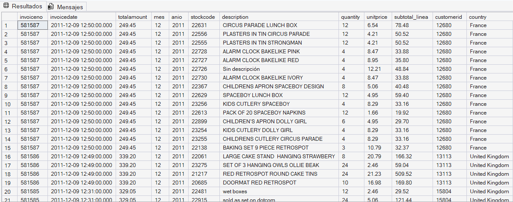

# 🗄️ Modelo Relacional y Normalización de Datos

Después del proceso de limpieza y transformación de datos en Python, se diseñó un modelo relacional en SQL Server con el objetivo de optimizar la integridad, organización y escalabilidad de la información.

El modelo fue estructurado siguiendo principios de normalización para evitar redundancia de datos y facilitar consultas analíticas orientadas al negocio.

---

# 📌 Tablas del Modelo Relacional

## 👥 Tabla: clientes

Contiene información relacionada con los clientes registrados.

| Campo |
|---|
| customerid |
| country |

---

## 📦 Tabla: productos

Contiene información de los productos comercializados.

| Campo |
|---|
| stockcode |
| description |
| unitprice |

---

## 🧾 Tabla: ventas

Contiene información general de cada transacción comercial.

| Campo |
|---|
| id_venta |
| invoiceno |
| customerid |
| invoicedate |
| totalamount |
| mes |
| anio |

---

## 📑 Tabla: detalle_ventas

Contiene el detalle de productos vendidos por transacción.

| Campo |
|---|
| id_detalle |
| id_venta |
| stockcode |
| quantity |

---

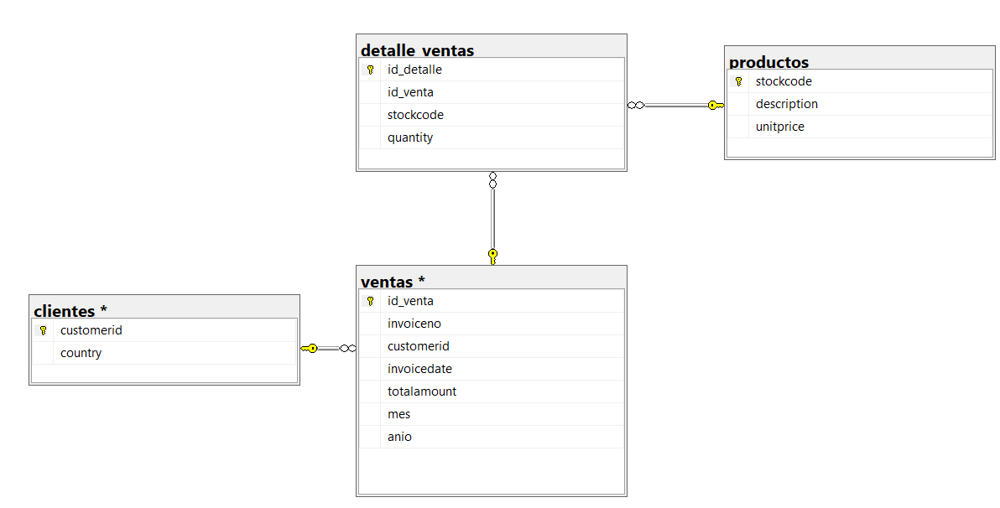

## 🔗 Relaciones del Modelo

- Un cliente puede realizar múltiples ventas.
- Una venta puede contener múltiples productos.
- Un producto puede aparecer en múltiples ventas.

---

## 🎯 Objetivo del Modelo Relacional

- Mejorar organización de datos
- Facilitar consultas SQL complejas
- Optimizar rendimiento analítico
- Garantizar integridad relacional
- Preparar el entorno para Business Intelligence

---

# 🧠 Fase 2: Preguntas de Negocio

En esta etapa se plantean preguntas estratégicas orientadas a comprender el comportamiento del negocio, detectar oportunidades y generar valor empresarial mediante análisis de datos.

---

## 📌 Preguntas de Negocio

1. ¿Cuál es el ingreso total generado?
2. ¿Qué países generan más ventas?
3. ¿Cuáles son los productos más vendidos?
4. ¿Qué productos generan mayores ingresos?
5. ¿Cuál es el ticket promedio por compra?
6. ¿Quiénes son los clientes más valiosos?
7. ¿Qué clientes compran con mayor frecuencia?
8. ¿Cuáles son los meses con mayores ventas?
9. ¿Existen patrones de estacionalidad?
10. ¿Qué productos presentan más devoluciones?
11. ¿Qué países tienen menor actividad comercial?
12. ¿Qué productos suelen comprarse juntos?
13. ¿Qué porcentaje de clientes concentra los ingresos?
14. ¿Existen clientes inactivos o en riesgo?
15. ¿Qué clientes representan mayores oportunidades de negocio?
---

# 🗄️ Fase 3: Análisis SQL

Después del procesamiento y limpieza de datos, se realizan consultas SQL orientadas al análisis empresarial y generación de insights estratégicos.

---

## 🎯 Objetivos del Análisis SQL

- Generar KPIs empresariales.
- Analizar comportamiento de clientes.
- Detectar patrones de ventas.
- Identificar oportunidades comerciales.
- Evaluar rendimiento del negocio.
- Construir análisis orientados a toma de decisiones.

---

# 🗄️ Fase 3: Análisis SQL

En esta fase se desarrollan consultas SQL orientadas al análisis estratégico del negocio.  

El objetivo es transformar datos transaccionales en información útil para comprender el comportamiento de clientes, ventas y productos, facilitando la toma de decisiones empresariales.

---

## 📌 Pregunta 1: ¿Cuál es el ingreso total generado?

### 🎯 Objetivo
Determinar cuánto dinero generó el negocio durante todo el período analizado.

```sql
SELECT 
    ROUND(SUM(totalamount),2) AS ingreso_total
FROM ventas;
```
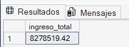

#### 🧠 Insight
Este indicador permite medir el rendimiento financiero global de la empresa y conocer  el volumen total de ingresos obtenidos.

---

## 📌 Pregunta 2: ¿Qué países generan más ventas?

### 🎯 Objetivo
Identificar los mercados internacionales con mayor facturación.

```sql
SELECT 
    c.country,
    ROUND(SUM(v.totalamount),2) AS total_ventas
FROM ventas v
JOIN clientes c
    ON v.customerid = c.customerid
GROUP BY c.country
ORDER BY total_ventas DESC;
```
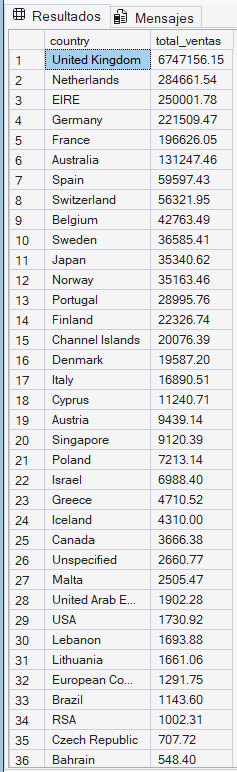

#### 🧠 Insight
Permite detectar qué países representan las principales fuentes de ingresos y dónde existe mayor demanda comercial.

---

## 📌 Pregunta 3: ¿Cuáles son los productos más vendidos?

### 🎯 Objetivo
Identificar los productos con mayor volumen de ventas.

```sql
SELECT TOP 10
    p.description,
    SUM(dv.quantity) AS total_vendido
FROM detalle_ventas dv
JOIN productos p
    ON dv.stockcode = p.stockcode
WHERE p.description IS NOT NULL
AND p.description <> ''
AND p.description <> 'Sin descripción'
GROUP BY p.description
ORDER BY total_vendido DESC;
```

#### 🧠 Insight
Ayuda a detectar productos altamente demandados y comprender las preferencias de los clientes.

---
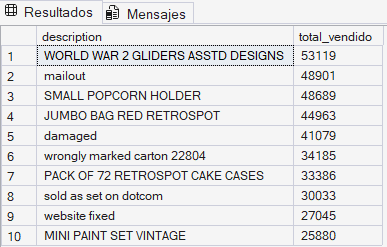

## 📌 Pregunta 4: ¿Qué productos generan mayores ingresos?
###  🎯 Objetivo
Determinar qué productos aportan más rentabilidad al negocio.

```sql
SELECT TOP 10
    p.description,
    ROUND(SUM(dv.quantity * p.unitprice),2) AS ingresos
FROM detalle_ventas dv
JOIN productos p
    ON dv.stockcode = p.stockcode
WHERE p.description IS NOT NULL
AND p.description <> ''
AND p.description <> 'Sin descripción'
GROUP BY p.description
ORDER BY ingresos DESC;
```
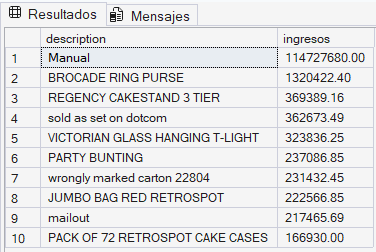

####  🧠 Insight
No siempre los productos más vendidos son los más rentables. Este análisis permite identificar productos estratégicos.

---

##  📌 Pregunta 5: ¿Cuál es el ticket promedio por compra?

###  🎯 Objetivo
Calcular el gasto promedio realizado por transacción.

```sql
SELECT 
    ROUND(AVG(totalamount),2) AS ticket_promedio
FROM ventas;
```

####  🧠 Insight
Permite entender cuánto gasta un cliente en promedio cada vez que realiza una compra.

---
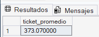

## 📌 Pregunta 6: ¿Quiénes son los clientes más valiosos?

## # 🎯 Objetivo
Identificar los clientes que generan mayores ingresos para la empresa.

```sql
SELECT TOP 10
    customerid,
    ROUND(SUM(totalamount),2) AS gasto_total
FROM ventas
GROUP BY customerid
ORDER BY gasto_total DESC;
```
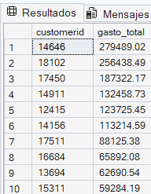

####  🧠 Insight
Permite detectar clientes VIP y desarrollar estrategias de fidelización orientadas a clientes de alto valor.

---

##  📌 Pregunta 7: ¿Qué clientes compran con mayor frecuencia?

###  🎯 Objetivo
Detectar clientes con mayor recurrencia de compra.

```sql
SELECT TOP 10
    c.customerid,
    COUNT(v.invoiceno) AS frecuencia_compras
FROM ventas v
JOIN clientes c
    ON v.customerid = c.customerid
GROUP BY c.customerid
ORDER BY frecuencia_compras DESC;
```
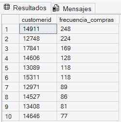

####  🧠 Insight
Ayuda a medir fidelización y comportamiento recurrente de consumo.

---

## 📌 Pregunta 8: ¿Cuáles son los meses con mayores ventas?

###  🎯 Objetivo
Analizar el comportamiento temporal de las ventas.

```sql
SELECT 
    mes,
    ROUND(SUM(totalamount),2) AS ventas_totales
FROM ventas
GROUP BY mes
ORDER BY ventas_totales DESC;
```
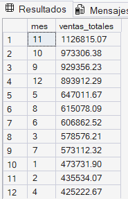

####  🧠 Insight
Permite identificar temporadas de alta demanda y posibles patrones estacionales.

---

##  📌 Pregunta 9: ¿Existen patrones de estacionalidad?

### 🎯 Objetivo
Evaluar la evolución de ventas a lo largo del tiempo.

```sql
SELECT 
    anio,
    mes,
    ROUND(SUM(totalamount),2) AS ventas
FROM detalle_ventas
GROUP BY anio, mes
ORDER BY anio, mes;
```
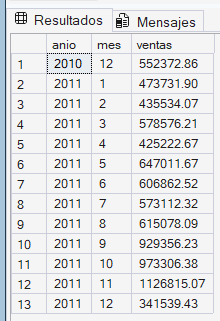

####  🧠 Insight
Ayuda a comprender tendencias de crecimiento, estabilidad o desaceleración del negocio.

---

##  📌 Pregunta 10: ¿Qué productos tienen más devoluciones?

###  🎯 Objetivo
Detectar productos asociados a devoluciones frecuentes.

```sql
SELECT TOP 10
    p.description,
    COUNT(*) AS devoluciones
FROM detalle_ventas dv
JOIN productos p
    ON dv.stockcode = p.stockcode
WHERE dv.quantity < 0
AND p.description IS NOT NULL
AND p.description <> ''
AND p.description <> 'Sin descripción'
GROUP BY p.description
ORDER BY devoluciones DESC;
```
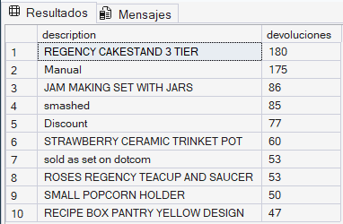

####  🧠 Insight
Las devoluciones pueden indicar problemas de calidad, logística o satisfacción del cliente.

---

## 📌 Pregunta 11: ¿Qué países presentan menor actividad comercial?

### 🎯 Objetivo
Identificar mercados con menor volumen de ventas.

```sql
SELECT TOP 10
    c.country,
    ROUND(SUM(v.totalamount),2) AS ventas_totales
FROM ventas v
JOIN clientes c
    ON v.customerid = c.customerid
GROUP BY c.country
ORDER BY ventas_totales ASC;
```
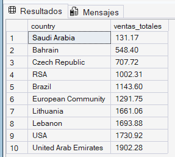

#### 🧠 Insight
Permite detectar mercados poco explotados o con bajo rendimiento comercial.

---

## 📌 Pregunta 12: ¿Qué productos suelen comprarse juntos?

### 🎯 Objetivo
Identificar patrones de compra conjunta.

```sql
SELECT TOP 20
    p1.description AS producto_1,
    p2.description AS producto_2,
    COUNT(*) AS frecuencia
FROM detalle_ventas d1
JOIN detalle_ventas d2
    ON d1.id_venta = d2.id_venta
    AND d1.stockcode < d2.stockcode

JOIN productos p1
    ON d1.stockcode = p1.stockcode

JOIN productos p2
    ON d2.stockcode = p2.stockcode

WHERE p1.description IS NOT NULL
AND p1.description <> ''
AND p1.description <> 'Sin descripción'

AND p2.description IS NOT NULL
AND p2.description <> ''
AND p2.description <> 'Sin descripción'

GROUP BY p1.description, p2.description
ORDER BY frecuencia DESC;
```
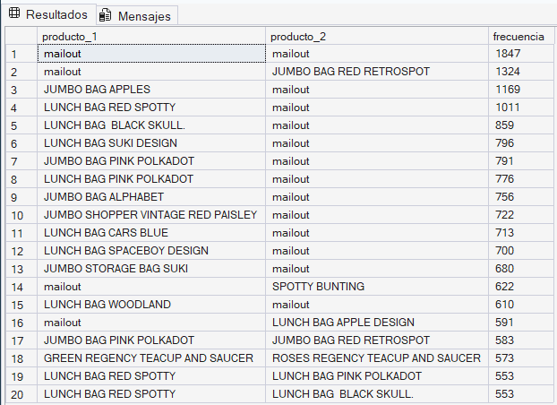

#### 🧠 Insight
Este análisis permite desarrollar estrategias de cross-selling y recomendaciones de productos.

---

## 📌 Pregunta 13: ¿Qué porcentaje de clientes concentra los ingresos?

### 🎯 Objetivo
Analizar la concentración de ingresos por clientes.

```sql
SELECT TOP 20
    c.customerid,
    ROUND(SUM(v.totalamount),2) AS ingresos
FROM ventas v
JOIN clientes c
    ON v.customerid = c.customerid
GROUP BY c.customerid
ORDER BY ingresos DESC;
```
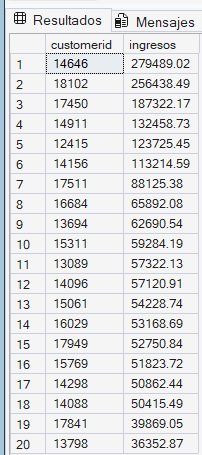

#### 🧠 Insight
Generalmente un pequeño grupo de clientes concentra gran parte de los ingresos del negocio.

---

## 📌 Pregunta 14: ¿Existen clientes inactivos o en riesgo?

## 🎯 Objetivo
Detectar clientes con baja actividad reciente.

```sql
SELECT
    c.customerid,
    MAX(v.invoicedate) AS ultima_compra
FROM ventas v
JOIN clientes c
    ON v.customerid = c.customerid
GROUP BY c.customerid
ORDER BY ultima_compra ASC;
```
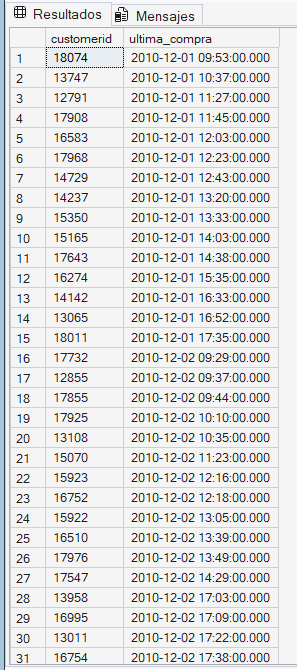

### 🧠 Insight
Permite identificar clientes potencialmente inactivos para futuras campañas de recuperación.

---

## 📌 Pregunta 15:  ¿Qué clientes generan mayores oportunidades de negocio?

### 🎯 Objetivo
Identificar clientes con alto potencial comercial considerando frecuencia de compra e ingresos generados.

```sql
SELECT TOP 10
    customerid,
    COUNT(invoiceno) AS total_compras,
    ROUND(SUM(totalamount),2) AS ingresos_generados,
    ROUND(AVG(totalamount),2) AS ticket_promedio
FROM ventas
GROUP BY customerid
ORDER BY ingresos_generados DESC;
```


#### 🧠 Insight
Ayuda a comprender tendencias de crecimiento, estabilidad o desaceleración del negocio.Este análisis permite detectar clientes estratégicos para campañas de fidelización, programas VIP y estrategias de retención enfocadas en maximizar ingresos.

---

### 📈 Conclusión de la Fase

El análisis SQL permitió transformar datos transaccionales en información estratégica útil para comprender el comportamiento del negocio.

A través de las consultas realizadas fue posible:

- Identificar clientes de alto valor.
- Detectar productos más rentables.
- Analizar mercados internacionales.
- Comprender patrones de compra.
- Evaluar tendencias temporales.
- Detectar oportunidades comerciales.

Finalmente, esta fase constituye la base para la construcción de KPIs, dashboards y futuros modelos de Business Intelligence orientados a la toma de decisiones basada en datos.

# 📊 Fase 4: KPIs Estratégicos y Business Intelligence

En esta fase se construyen indicadores clave de rendimiento (KPIs) orientados al análisis empresarial y la toma de decisiones estratégicas.

Los KPIs permiten transformar grandes volúmenes de datos en métricas claras y accionables para evaluar el rendimiento del negocio.

---

# 🎯 Objetivos de la Fase

- Medir el rendimiento comercial del negocio.
- Identificar oportunidades de crecimiento.
- Detectar patrones de comportamiento de clientes.
- Evaluar rentabilidad y desempeño de ventas.
- Facilitar la toma de decisiones basada en datos.
- Construir una visión orientada a Business Intelligence.

---

# 🧠 ¿Qué es un KPI?

Un KPI (Key Performance Indicator) es un indicador utilizado para medir el desempeño de un proceso, área o negocio en función de objetivos estratégicos.

Dentro de este proyecto, los KPIs permiten analizar:

- 📈 Ventas
- 👥 Clientes
- 💰 Rentabilidad
- 🌎 Mercados
- 📦 Productos
- 🛒 Comportamiento comercial

---

# 📌 KPI 1: Ingreso Total del Negocio

### 🎯 Objetivo
Calcular el total de ingresos generados por todas las ventas.

```sql
SELECT 
    ROUND(SUM(totalamount),2) AS ingreso_total
FROM ventas;
```
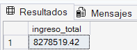

### 🧠 Valor Estratégico
Permite medir el rendimiento financiero general de la empresa.

---

# 📌 KPI 2: Ticket Promedio por Compra

### 🎯 Objetivo
Determinar el gasto promedio realizado por transacción.

```sql
SELECT 
    ROUND(AVG(totalamount),2) AS ticket_promedio
FROM ventas;
```


### 🧠 Valor Estratégico
Ayuda a comprender el comportamiento de consumo y el valor promedio de cada compra.

---

# 📌 KPI 3: Total de Clientes Únicos

### 🎯 Objetivo
Identificar la cantidad total de clientes registrados.

```sql
SELECT 
    COUNT(DISTINCT customerid) AS total_clientes
FROM clientes;
```
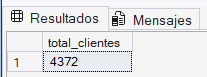

### 🧠 Valor Estratégico
Permite medir el alcance comercial y tamaño de la cartera de clientes.

---

# 📌 KPI 4: Total de Transacciones

### 🎯 Objetivo
Calcular la cantidad total de compras realizadas.

```sql
SELECT 
    COUNT(DISTINCT invoiceno) AS total_transacciones
FROM ventas;
```
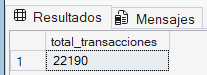

### 🧠 Valor Estratégico
Ayuda a evaluar el nivel de actividad comercial del negocio.

---

# 📌 KPI 5: Producto Más Vendido

### 🎯 Objetivo
Identificar el producto con mayor volumen de ventas.

```sql
SELECT TOP 1
    p.description,
    SUM(dv.quantity) AS total_vendido
FROM detalle_ventas dv
JOIN productos p
    ON dv.stockcode = p.stockcode
WHERE p.description IS NOT NULL
AND p.description <> ''
AND p.description <> 'Sin descripción'
GROUP BY p.description
ORDER BY total_vendido DESC;
```
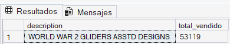

### 🧠 Valor Estratégico
Permite detectar productos líderes y optimizar estrategias de inventario.

---

# 📌 KPI 6: Producto con Mayor Rentabilidad

### 🎯 Objetivo
Identificar el producto que genera mayores ingresos.

```sql
SELECT TOP 1
    p.description,
    ROUND(SUM(dv.quantity * p.unitprice),2) AS ingresos
FROM detalle_ventas dv
JOIN productos p
    ON dv.stockcode = p.stockcode
WHERE p.description IS NOT NULL
AND p.description <> ''
AND p.description <> 'Sin descripción'
GROUP BY p.description
ORDER BY ingresos DESC;
```
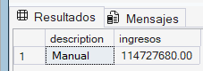

### 🧠 Valor Estratégico
Ayuda a detectar productos estratégicos y de alta rentabilidad.

---

# 📌 KPI 7: País con Mayor Volumen de Ventas

### 🎯 Objetivo
Determinar el país con mayores ingresos generados.

```sql
SELECT TOP 1
    c.country,
    ROUND(SUM(v.totalamount),2) AS ventas_totales
FROM ventas v
JOIN clientes c
    ON v.customerid = c.customerid
GROUP BY c.country
ORDER BY ventas_totales DESC;
```
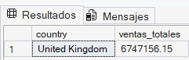

### 🧠 Valor Estratégico
Permite identificar mercados prioritarios y oportunidades de expansión.

---

# 📌 KPI 8: Cliente Más Valioso

### 🎯 Objetivo
Identificar el cliente con mayor gasto acumulado.

```sql
SELECT TOP 1
    customerid,
    ROUND(SUM(totalamount),2) AS gasto_total
FROM ventas
GROUP BY customerid
ORDER BY gasto_total DESC;
```
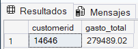

### 🧠 Valor Estratégico
Facilita el diseño de estrategias de fidelización y programas VIP.

---

# 📌 KPI 9: Mes con Mayor Facturación

### 🎯 Objetivo
Detectar el período con mayores ingresos.

```sql
SELECT TOP 1
    mes,
    ROUND(SUM(totalamount),2) AS ventas_totales
FROM ventas
GROUP BY mes
ORDER BY ventas_totales DESC;
```
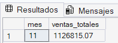

### 🧠 Valor Estratégico
Permite identificar temporadas fuertes y planificar campañas comerciales.

---

# 📌 KPI 10: Tasa de Devoluciones

### 🎯 Objetivo
Calcular el porcentaje de productos devueltos.

```sql
SELECT 
    ROUND(
        (SUM(CASE WHEN quantity < 0 THEN 1 ELSE 0 END) * 100.0)
        / COUNT(*),
    2) AS tasa_devoluciones
FROM detalle_ventas;
```
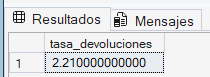

### 🧠 Valor Estratégico
Ayuda a detectar problemas de calidad, logística o satisfacción del cliente.

---

# 📌 KPI 11: Clientes Más Frecuentes

### 🎯 Objetivo
Identificar clientes con mayor recurrencia de compra.

```sql
SELECT TOP 10
    customerid,
    COUNT(invoiceno) AS frecuencia_compras
FROM ventas
GROUP BY customerid
ORDER BY frecuencia_compras DESC;
```


### 🧠 Valor Estratégico
Permite detectar clientes leales y potenciales embajadores de marca.

---

# 📌 KPI 12: Promedio de Productos por Compra

### 🎯 Objetivo
Calcular la cantidad promedio de productos por transacción.

```sql
SELECT 
    ROUND(AVG(cantidad_productos),2) AS promedio_productos
FROM (
    SELECT 
        id_venta,
        SUM(quantity) AS cantidad_productos
    FROM detalle_ventas
    GROUP BY id_venta
) AS resumen;
```
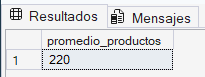

### 🧠 Valor Estratégico
Ayuda a comprender hábitos de compra y tamaño promedio de pedidos.

---

# 📌 KPI 13: Top 5 Mercados Internacionales

### 🎯 Objetivo
Identificar los principales mercados del negocio.

```sql
SELECT TOP 5
    c.country,
    ROUND(SUM(v.totalamount),2) AS ingresos
FROM ventas v
JOIN clientes c
    ON v.customerid = c.customerid
GROUP BY c.country
ORDER BY ingresos DESC;
```
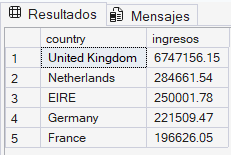

### 🧠 Valor Estratégico
Permite enfocar estrategias comerciales en mercados altamente rentables.

---

# 📌 KPI 14: Total de Productos Diferentes Vendidos

### 🎯 Objetivo
Medir la diversidad de productos comercializados.

```sql
SELECT 
    COUNT(DISTINCT stockcode) AS productos_diferentes
FROM detalle_ventas;
```
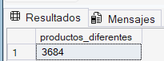

### 🧠 Valor Estratégico
Ayuda a evaluar amplitud de catálogo y variedad comercial.

---

# 📌 KPI 15: Clientes Estratégicos de Alto Valor

### 🎯 Objetivo
Identificar clientes con alto potencial comercial.

```sql
SELECT TOP 10
    customerid,
    COUNT(invoiceno) AS total_compras,
    ROUND(SUM(totalamount),2) AS ingresos_generados,
    ROUND(AVG(totalamount),2) AS ticket_promedio
FROM ventas
GROUP BY customerid
ORDER BY ingresos_generados DESC;
```
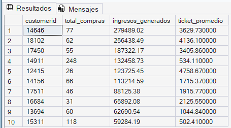

### 🧠 Valor Estratégico
Permite desarrollar estrategias avanzadas de retención, fidelización y segmentación premium.

---

# 📈 Aplicación de Business Intelligence

Los KPIs desarrollados permiten construir dashboards y sistemas de análisis orientados a Business Intelligence.

Gracias a estos indicadores es posible:

- 📊 Monitorear rendimiento comercial
- 📈 Detectar tendencias de crecimiento
- 🌎 Analizar mercados estratégicos
- 👥 Comprender comportamiento de clientes
- 💰 Optimizar ingresos
- 🚀 Mejorar la toma de decisiones

---

# 🧠 Conclusión de la Fase

La construcción de KPIs estratégicos permitió transformar datos operacionales en métricas empresariales de alto valor.

Este enfoque facilita el desarrollo de soluciones modernas orientadas a:

- Data Analytics
- Business Intelligence
- Análisis Comercial
- Inteligencia de Clientes
- Optimización de Ventas
- Toma de decisiones basada en datos

---
# 📊 Fase 5: Visualización de Datos con Python

En esta fase se desarrollan visualizaciones orientadas al análisis estratégico del negocio utilizando Python.

La visualización de datos permite transformar grandes volúmenes de información en gráficos claros, dinámicos e interpretables, facilitando la toma de decisiones basada en datos.

---

# 🎯 Objetivos de la Fase

- Representar visualmente KPIs estratégicos.
- Detectar patrones y tendencias comerciales.
- Analizar comportamiento de clientes y ventas.
- Facilitar la interpretación de resultados.
- Construir gráficos orientados a Business Intelligence.

---

# 🛠️ Librerías Utilizadas

```python
import pandas as pd
import matplotlib.pyplot as plt
import pyodbc
```

---

# 🔗 Conexión entre Python y SQL Server

Durante esta etapa se establece la conexión entre Python y SQL Server para consultar información directamente desde la base de datos.

```python
import pyodbc

conexion = pyodbc.connect(
    'DRIVER={SQL Server};'
    'SERVER=localhost;'
    'DATABASE=Proyecto_Ventas_Inteligente;'
    'Trusted_Connection=yes;'
)

print("Conexión exitosa")
```

---

# 📈 Visualización 1: Top 10 Países con Más Ventas

## 🎯 Objetivo
Identificar los países que generan mayores ingresos.

```python
query = """
SELECT TOP 10
    c.country,
    SUM(v.totalamount) AS ventas
FROM ventas v
JOIN clientes c
    ON v.customerid = c.customerid
GROUP BY c.country
ORDER BY ventas DESC
"""
df = pd.read_sql(query, conexion)

plt.figure(figsize=(10,6))
plt.bar(df['country'], df['ventas'])

plt.xticks(rotation=45)
plt.title('Top 10 Países con Más Ventas')
plt.xlabel('País')
plt.ylabel('Ventas')

plt.show()
```
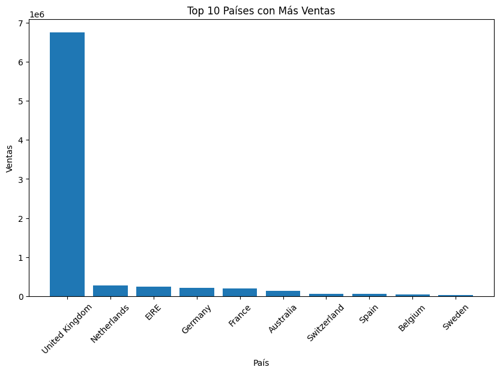

### 🧠 Insight
Permite identificar los mercados internacionales más importantes para el negocio.

---

# 📈 Visualización 2: Productos Más Vendidos

## 🎯 Objetivo
Detectar los productos con mayor volumen de ventas.

```python
query = """
SELECT TOP 10
    p.description,
    SUM(dv.quantity) AS total_vendido
FROM detalle_ventas dv
JOIN productos p
    ON dv.stockcode = p.stockcode
WHERE p.description IS NOT NULL
AND p.description <> ''
AND p.description <> 'Sin descripción'
GROUP BY p.description
ORDER BY total_vendido DESC
"""

df = pd.read_sql(query, conexion)

plt.figure(figsize=(12,6))
plt.barh(df['description'], df['total_vendido'])

plt.title('Productos Más Vendidos')
plt.xlabel('Cantidad Vendida')
plt.ylabel('Producto')

plt.show()
```
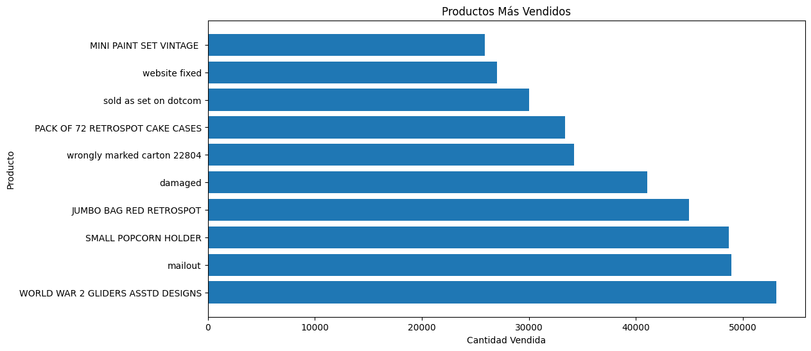

### 🧠 Insight
Ayuda a comprender las preferencias de compra de los clientes.

---

# 📈 Visualización 3: Evolución de Ventas por Mes

## 🎯 Objetivo
Analizar el comportamiento temporal de las ventas.

```python
query = """
SELECT
    anio,
    mes,
    SUM(totalamount) AS ventas
FROM ventas
GROUP BY anio, mes
ORDER BY anio, mes
"""

df = pd.read_sql(query, conexion)

df['periodo'] = df['anio'].astype(str) + '-' + df['mes'].astype(str)

plt.figure(figsize=(12,6))
plt.plot(df['periodo'], df['ventas'])

plt.xticks(rotation=45)
plt.title('Evolución de Ventas')
plt.xlabel('Periodo')
plt.ylabel('Ventas')

plt.show()
```
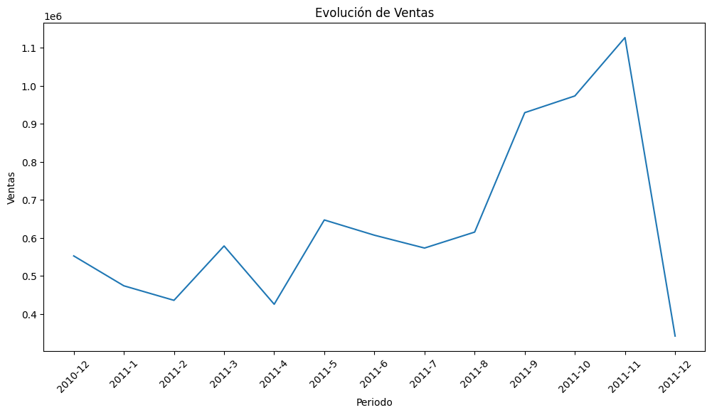

### 🧠 Insight
Permite detectar patrones estacionales y tendencias de crecimiento.

---

# 📈 Visualización 4: Clientes con Mayor Gasto

## 🎯 Objetivo
Identificar clientes estratégicos para el negocio.

```python
query = """
SELECT TOP 10
    customerid,
    SUM(totalamount) AS gasto_total
FROM ventas
GROUP BY customerid
ORDER BY gasto_total DESC
"""

df = pd.read_sql(query, conexion)

plt.figure(figsize=(10,6))
plt.bar(df['customerid'].astype(str), df['gasto_total'])

plt.title('Clientes con Mayor Gasto')
plt.xlabel('Cliente')
plt.ylabel('Ingresos Generados')

plt.show()
```
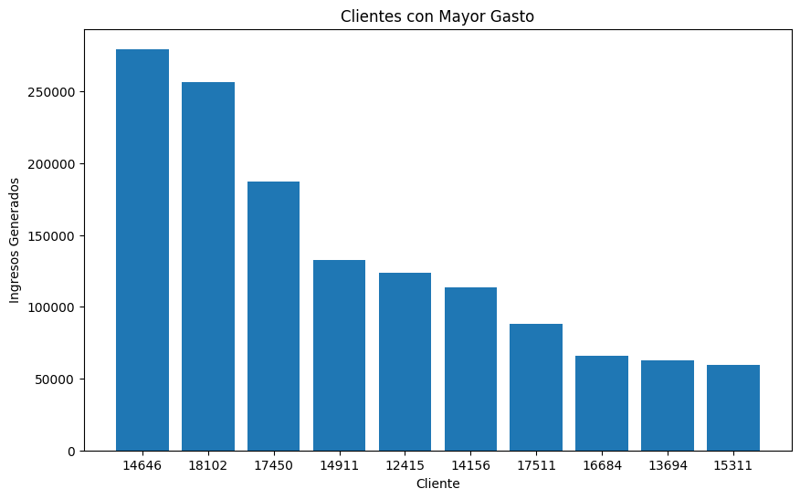

### 🧠 Insight
Permite detectar clientes VIP y oportunidades de fidelización.

---

# 📈 Visualización 5: Distribución de Ventas por Mes

## 🎯 Objetivo
Analizar cuáles son los meses con mayor facturación.

```python
query = """
SELECT
    mes,
    SUM(totalamount) AS ventas
FROM ventas
GROUP BY mes
ORDER BY mes
"""

df = pd.read_sql(query, conexion)

plt.figure(figsize=(10,6))
plt.plot(df['mes'], df['ventas'])

plt.title('Ventas por Mes')
plt.xlabel('Mes')
plt.ylabel('Ventas')

plt.show()
```
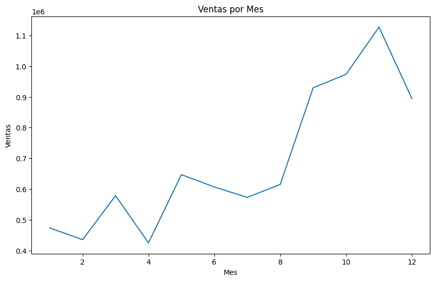

### 🧠 Insight
Ayuda a identificar temporadas de alta demanda y comportamiento estacional.

---

# 📈 Visualización 6: Top Productos Más Rentables

## 🎯 Objetivo
Detectar productos que generan mayores ingresos.

```python
query = """
SELECT TOP 10
    p.description,
    SUM(dv.quantity * p.unitprice) AS ingresos
FROM detalle_ventas dv
JOIN productos p
    ON dv.stockcode = p.stockcode
WHERE p.description IS NOT NULL
AND p.description <> ''
AND p.description <> 'Sin descripción'
GROUP BY p.description
ORDER BY ingresos DESC
"""

df = pd.read_sql(query, conexion)

plt.figure(figsize=(12,6))
plt.barh(df['description'], df['ingresos'])

plt.title('Productos Más Rentables')
plt.xlabel('Ingresos')
plt.ylabel('Producto')

plt.show()
```
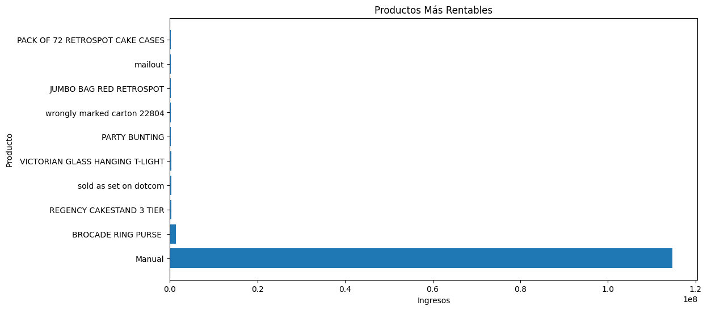

### 🧠 Insight
Permite identificar productos clave para maximizar rentabilidad.

---

# 📈 Visualización 7: Clientes con Mayor Frecuencia de Compra

## 🎯 Objetivo
Detectar clientes recurrentes.

```python
query = """
SELECT TOP 10
    customerid,
    COUNT(invoiceno) AS frecuencia
FROM ventas
GROUP BY customerid
ORDER BY frecuencia DESC
"""

df = pd.read_sql(query, conexion)

plt.figure(figsize=(10,6))
plt.bar(df['customerid'].astype(str), df['frecuencia'])

plt.title('Clientes Más Frecuentes')
plt.xlabel('Cliente')
plt.ylabel('Frecuencia de Compras')

plt.show()
```
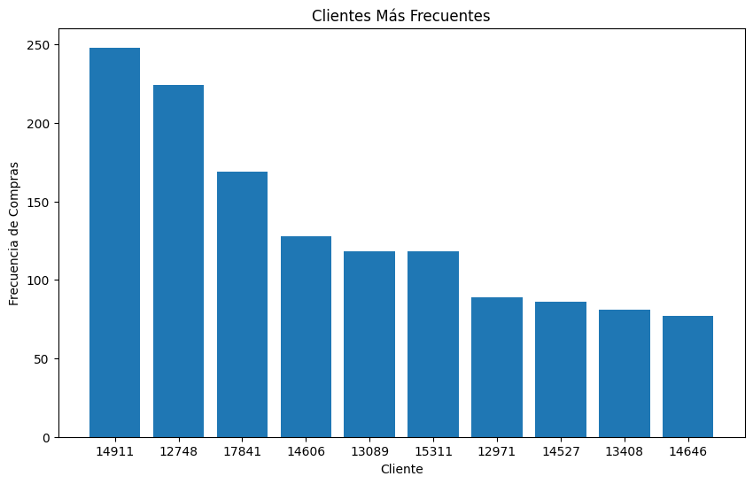

### 🧠 Insight
Ayuda a identificar clientes leales y patrones de recompra.

---

## 📈 Aplicación de Business Intelligence

Las visualizaciones desarrolladas permiten:

- 📊 Monitorear KPIs estratégicos
- 📈 Detectar tendencias de crecimiento
- 🌎 Analizar mercados internacionales
- 👥 Comprender comportamiento de clientes
- 📦 Optimizar inventario y productos
- 🚀 Mejorar la toma de decisiones

---

## 🧠 Conclusión de la Fase

La integración entre Python y SQL Server permitió desarrollar visualizaciones dinámicas orientadas al análisis empresarial y Business Intelligence.

Este enfoque combina:

- Python
- SQL
- Visualización de datos
- KPIs estratégicos
- Análisis comercial

permitiendo construir soluciones modernas basadas en datos para la toma de decisiones inteligentes.

---

# 🚀 Fase 6: Conclusiones Estratégicas y Recomendaciones de Negocio

En esta fase final se interpretan los resultados obtenidos durante el análisis de datos, las consultas SQL, los KPIs estratégicos y las visualizaciones desarrolladas en Python.

El objetivo es transformar los hallazgos técnicos en información útil para la toma de decisiones empresariales.

---

## 🎯 Objetivos de la Fase

- Interpretar los resultados obtenidos.
- Detectar oportunidades de mejora.
- Identificar riesgos comerciales.
- Proponer estrategias basadas en datos.
- Generar valor empresarial mediante analítica.

---

## 📊 Principales Hallazgos del Proyecto

### 📈 1. Concentración de Ingresos en un Grupo Reducido de Clientes

El análisis permitió identificar que un pequeño grupo de clientes genera una parte significativa de los ingresos totales del negocio.

#### 🧠 Impacto Empresarial
Esto evidencia la importancia de desarrollar estrategias de fidelización para clientes VIP y programas de retención personalizados.

---

### 🌎 2. Existen Países con Mayor Potencial Comercial

Algunos países concentran gran parte de las ventas internacionales, mientras que otros presentan baja actividad comercial.

#### 🧠 Impacto Empresarial
La empresa puede enfocar campañas comerciales y estrategias de expansión en mercados altamente rentables.

---

### 📦 3. Productos Estratégicos Dominan las Ventas

Se detectaron productos con altos niveles de demanda y productos con mayor rentabilidad.

#### 🧠 Impacto Empresarial
Esto permite optimizar:

- Inventario
- Marketing
- Reposición de stock
- Estrategias comerciales

---

### 🔄 4. Las Devoluciones Representan un Riesgo Operacional

Algunos productos presentan altos niveles de devoluciones.

#### 🧠 Impacto Empresarial
Las devoluciones podrían estar asociadas a:

- Problemas de calidad
- Fallas logísticas
- Baja satisfacción del cliente

---

### 📅 5. Existe Estacionalidad en las Ventas

Las ventas presentan variaciones importantes dependiendo del mes y período del año.

#### 🧠 Impacto Empresarial
Esto permite planificar:

- Campañas comerciales
- Promociones
- Gestión de inventario
- Proyecciones financieras

---

### 👥 6. Clientes Frecuentes Representan Oportunidades de Fidelización

Se identificaron clientes con alta recurrencia de compra y elevado gasto promedio.

#### 🧠 Impacto Empresarial
Estos clientes pueden convertirse en:

- Clientes premium
- Embajadores de marca
- Objetivo de campañas exclusivas

---

## 📌 Recomendaciones Estratégicas

#### 🚀 Implementar Programas de Fidelización

Diseñar estrategias orientadas a clientes de alto valor:

- Descuentos exclusivos
- Beneficios premium
- Programas de puntos
- Atención personalizada

---

#### 📊 Construir Dashboards Interactivos

Integrar herramientas como:

- Power BI
- Tableau
- Streamlit

para monitorear KPIs en tiempo real.

---

#### 📦 Optimizar Gestión de Inventario

Priorizar productos:

- Más vendidos
- Más rentables
- Con menor nivel de devoluciones

---

#### 🌎 Expandir Mercados Estratégicos

Incrementar inversiones comerciales en países con mayor rendimiento.

---

#### 🔍 Monitorear Productos con Alta Devolución

Implementar controles de calidad y análisis de satisfacción del cliente.

---

## 🧠 Aplicación Empresarial del Proyecto

Este proyecto puede aplicarse en áreas como:

- Business Intelligence
- Data Analytics
- Ventas
- Marketing
- Gestión Comercial
- Inteligencia de Clientes
- Optimización Operacional

---

## 💡 Tecnologías y Herramientas Aplicadas

Durante el desarrollo del proyecto se utilizaron herramientas orientadas al análisis y procesamiento de datos:

- Python
- SQL Server
- Pandas
- Matplotlib
- PyODBC
- GitHub
- Visual Studio Code

---

## 📈 Resultados Obtenidos

El proyecto permitió:

✅ Procesar más de 500 mil registros  
✅ Construir una base de datos relacional  
✅ Desarrollar consultas SQL orientadas al negocio  
✅ Generar KPIs estratégicos  
✅ Crear visualizaciones dinámicas  
✅ Detectar patrones comerciales relevantes  
✅ Transformar datos en información estratégica  

---

# 🧠 Conclusión General

El desarrollo de este proyecto permitió comprender cómo la analítica de datos puede utilizarse para resolver problemas reales del negocio y mejorar la toma de decisiones.

La integración entre Python, SQL Server y visualización de datos permitió construir una solución orientada a Business Intelligence capaz de identificar patrones, oportunidades y comportamientos estratégicos dentro del negocio.

Más allá del análisis técnico, este proyecto demuestra cómo los datos pueden convertirse en una herramienta clave para generar valor empresarial, optimizar procesos y apoyar decisiones inteligentes basadas en evidencia.

---